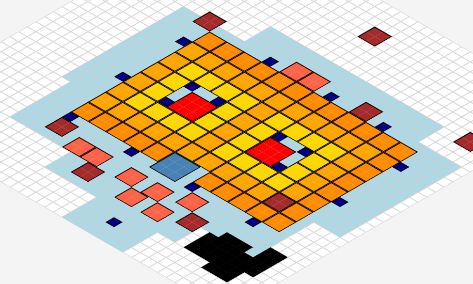

# Bear Trap Planner

A planning tool for optimizing Bear Trap layouts in Whiteout Survival. Design your alliance's layout efficiently with this interactive grid-based planner.

## Features

- **Interactive Grid**: 40x40 tile grid for detailed planning
- **Multiple Building Types**: Place HQ, Bear Traps, Furnaces, Banners, Resource Nodes, and Non-Buildable Areas
- **Drag and Drop**: Easily reposition objects after placement
- **Coverage Visualization**: See the coverage radius of HQ and Banners
- **Furnace Proximity Analysis**: Color-coded indicators for Furnace proximity to Bear Traps
- **Statistics Display**: Real-time counters for optimal layout planning
- **Naming System**: Label important buildings for better communication
- **Isometric View**: Toggle between top-down and isometric perspectives
- **Save/Load System**: Export and import your layouts for sharing or future editing

## Usage

### Building Placement

1. Click a building type button in the toolbar
2. Click anywhere on the grid to place the building
3. A preview will show valid/invalid placements before confirming

### Interactive Controls

- **Drag and Drop**: Click and drag any placed object to reposition it
- **Delete Mode**: Click the Delete button, then click objects to remove them
- **Set Names**: Click the Set Name button, then click on furnaces/HQ to add custom labels
- **Show/Hide Names**: Toggle the display of name labels
- **Isometric View**: Toggle between top-down and isometric perspectives

### Building Types and Limitations

| Building | Size | Limit | Coverage |
|----------|------|-------|----------|
| HQ | 3×3 | 1 | 7 tile radius |
| Bear Trap | 3×3 | 2 | None |
| Furnace | 2×2 | Unlimited | None |
| Banner | 1×1 | Unlimited | 3 tile radius |
| Resource Node | 2×2 | Unlimited | None |
| Non-Buildable Area | 1×1 | Unlimited | None |

### Statistics

The planner displays several important metrics to optimize your layout:

- Total number of Banners and Furnaces
- Uncovered Furnaces (lacking HQ/Banner protection)
- Furnaces by proximity to Bear Traps:
  - 1st Row (0-2 tiles from trap)
  - 2nd Row (3-4 tiles from trap)
  - 3rd Row (5-6 tiles from trap)

### Saving and Loading

- **Backup**: Save your current layout as a JSON file
- **Restore**: Load a previously saved layout JSON file

## Changelog

### v0.2 beta (Current)
- Complete code refactoring for improved maintainability
- Performance optimizations for large layouts
- Added chunked processing for smoother performance
- Improved error handling
- Better memory management
- Centralized state management

### v0.1 alpha
- Initial release with core functionality
- Basic grid system
- Object placement and manipulation
- Coverage visualization
- Statistics display

## Future Enhancements
- [ ] Add visual indicator of Furnaces with no coverage
- [ ] Better backup file handling
- [ ] Layout sharing via URL
- [ ] Improved visuals for buttons, labels etc.
- [ ] Grid size adjustment
- [ ] Mouse x-y coordinate display option
- [ ] Mobile-friendly responsive design
- [ ] Dark mode support
- [ ] More detailed statistics and analysis
- [ ] Improved proximity to trap measurement

## Known Issues
- [ ] Delete button selection issue in isometric mode
- [ ] Measurement of Furnace distance relative to Traps (eg. closest Furnace to Trap will count as second row if it is 3+ tiles away)
- [ ] Difficult to work with the planner on mobile

## Technical Fluff

The Bear Trap Planner is built with vanilla JavaScript, HTML, and CSS, with no external dependencies. The application uses:

- Modern JavaScript (ES6+) features
- CSS Grid for layout management
- CSS3 transitions for smooth visual effects
- Local browser storage for temporary saves
- File API for import/export functionality

## Credits

- **Author**: justncodes (\[SIR\] Yolo on #340)
- **Repository**: [justncodes.github.io](https://github.com/justncodes/justncodes.github.io)
- **Hosting**: Currently hosted by [Github Pages](https://pages.github.com/) at https://justncodes.github.io/

## Support

For bug reports and feature requests, please open an issue on the GitHub repository.

## License

This project is licensed under the GPLv3 License. See the [LICENSE](LICENSE) file for details.